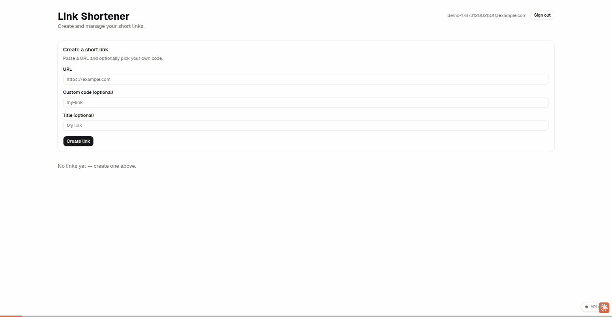

# Link Shortener with Analytics

[](https://github.com/AlexGitHubAccount/link-shortener-with-analytics/actions/workflows/ci.yml)
[](https://github.com/AlexGitHubAccount/link-shortener-with-analytics/releases)

Учебный монорепозиторий для освоения Claude Code: сокращатель ссылок с детальной аналитикой (фиксация кликов, анализ referrer, разбор User-Agent). Построен от начала до конца как практическое упражнение по Claude Code в рамках корпоративного учебного курса.

## Демо



## Структура проекта

```
link-shortener/
├── apps/
│   ├── api/       # NestJS backend
│   ├── web/       # Vite + React frontend
│   └── e2e/       # Playwright E2E-тесты
├── packages/
│   └── shared-types/   # Общие TS-типы и DTO
├── docker-compose.yml  # PostgreSQL для локальной разработки
├── CHANGELOG.md         # История с датами — что сделано, одна запись на единицу работы
└── docs/assets/          # Скриншоты/GIF для README
```

## Быстрый старт

### Предварительные требования
- Node.js 24.16.0 (см. `.nvmrc`)
- pnpm (через corepack: `corepack enable && corepack prepare pnpm@latest --activate`)
- Docker и Docker Compose

### Установка

1. **Склонировать репозиторий и поставить зависимости**
   ```bash
   git clone git@github.com:AlexGitHubAccount/link-shortener-with-analytics.git
   cd link-shortener-with-analytics
   pnpm install
   ```

2. **Настроить переменные окружения**
   ```bash
   cp .env.example .env
   cp apps/api/.env.example apps/api/.env
   ```
   Значения по умолчанию подходят для локальной разработки как есть — править не нужно, если не менялись порты/креды.

3. **Поднять PostgreSQL** (в docker-compose)
   ```bash
   docker compose up -d postgres
   ```

4. **Инициализировать базу данных** (миграции Prisma)
   ```bash
   pnpm --filter api exec prisma migrate dev --name init
   ```

5. **Запустить dev-серверы** (backend на :4000, frontend на :5173)
   ```bash
   pnpm dev
   ```

6. **Проверить состояние**
   ```bash
   curl http://localhost:4000/health
   # открыть http://localhost:5173 в браузере
   ```

7. **Посмотреть документацию API** (опционально) — `http://localhost:4000/api/docs` (Swagger UI, генерируется из реальных DTO/контроллеров)

## Скрипты

- `pnpm dev` — запустить dev-серверы (Nest + Vite, HMR включён)
- `pnpm build` — собрать frontend + backend
- `pnpm lint` — ESLint по всем apps и packages
- `pnpm test` — unit-тесты (Jest + Vitest) по всем workspace
- `pnpm --filter api test:cov` / `pnpm --filter web test:cov` — unit-тесты с отчётом покрытия (порог 80%, оба workspace)
- `pnpm --filter e2e test:e2e` — Playwright E2E (нужны запущенные `pnpm dev` + `docker compose up -d postgres`; при первом запуске: `npx playwright install chromium` из `apps/e2e`)
- `pnpm docker:up` — поднять контейнер PostgreSQL
- `pnpm docker:down` — остановить контейнер PostgreSQL

## Монорепо и Claude Code

Этот проект — учебный полигон для возможностей Claude Code:
- **Plan mode** и `CLAUDE.md` (правила проекта)
- **Skills** (`.claude/skills/push-gate/` — гейт перед push; `.claude/skills/feature/` — плейбук команды разработки)
- **Subagents** (Explore, Plan, general-purpose, кастомные `qa-engineer` (ревью + E2E) / `devsecops-engineer` (ревью + инфра) и разработчики `backend-dev`/`frontend-dev`)
- **Agent Teams** (экспериментальные): `/feature <описание>` — состав 1 + 4 как в современной продуктовой команде, у каждого файла и задачи ровно один владелец: ведущий (архитектор и координатор, кода и инфры не пишет) + `backend-dev`/`frontend-dev` (свой код + свои юнит-тесты) + `qa-engineer` (ревью каждого изменения + сквозной E2E) + `devsecops-engineer` (вся инфра/CI/Docker/env/зависимости/релиз + security/devops-ревью). `qa-engineer` и `devsecops-engineer` — тиммейт и субагент-ревью в одном лице
- **MCP-серверы** (PostgreSQL, Context7, Docker, claude-in-chrome, Semgrep, Playwright, GitHub — полный список в таблице «MCP-серверы» файла `CLAUDE.md`)
- **Hooks**: здесь ничего не пушится вручную — pre-push hook блокирует `git push`, пока `/push-gate` не прогонит один полный проход детерминированных проверок (lint, affected type-check/test/build, скан секретов) зелёным. Гейт **только отчёт** — сам код не правит; находки чинятся вместе с человеком. Полную регрессию гоняет CI, не локальный push. `git commit` — отдельный лёгкий гейт (только lint). См. `.claude/README.md`.

Датированная история того, что построено, и какие возможности Claude Code практиковались по ходу — в `CHANGELOG.md`.

## Технологический стек

- **Frontend**: Vite, React 19+, TypeScript, React Router v7, TanStack Query v5, zustand, shadcn/ui, Tailwind v4, react-hook-form + zod, recharts
- **Backend**: NestJS, Prisma, PostgreSQL, `@nestjs/config`, `@nestjs/terminus`
- **DevOps**: pnpm workspaces, Turborepo, Docker Compose (dev-БД), production Docker-образы (`apps/api/Dockerfile`, `apps/web/Dockerfile`), GitHub Actions CI/CD (`.github/workflows/`)
- **Тестирование**: Jest (backend), Vitest + React Testing Library (frontend), Playwright (E2E, `apps/e2e/`)

## Аутентификация и база данных

- **Аутентификация**: Google OAuth + JWT (`apps/api/src/auth/`) — каждый приватный эндпоинт скоупится по авторизованному пользователю, сервер может отозвать токен (`POST /auth/logout`). Реальные креды Google Cloud должен предоставить тот, кто разворачивает проект локально (Claude Code не может их создать) — шаги настройки Google OAuth — в разделе Troubleshooting файла `CLAUDE.md`.

## Продакшен-сборка

```bash
docker build -f apps/api/Dockerfile -t link-shortener-api .
docker build -f apps/web/Dockerfile -t link-shortener-web .
```

Оба образа собираются из **корня репозитория** (не из `apps/api`/`apps/web`) — pnpm workspace нужен целиком. Подробности механики сборки, переменных окружения и известных граблей — в `CLAUDE.md` (разделы «Docker» и «Docker-сборка (pnpm workspace)»). Куда именно деплоить (Fly.io/Railway/VPS/...) — открытый вопрос, CI пока только тестирует, не деплоит.
- **База данных**: PostgreSQL в Docker, миграции через Prisma
- **Модели данных**: User, Link (короткие ссылки), Click (аналитика), разбор User-Agent

Команды запуска и конвенции проекта — в `CLAUDE.md`.

## Лицензия

Учебный проект для внутреннего использования в рамках курса по Claude Code.
